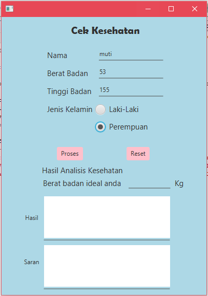
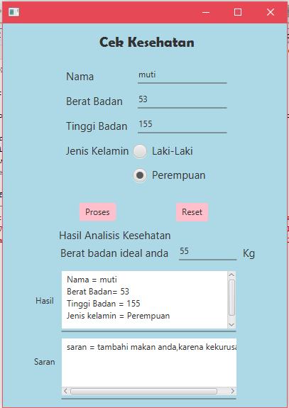
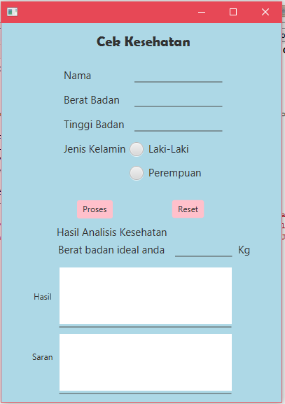

# CekKesehatan

1. pada gambar pertama ini, saya memasukkan data yang akan diproses.

2. pada gambar kedua, saya menampilkan data yang sudah dimasukkan dengan cara menekan tombol proses,dan kemudian data tersebut muncul pada text area hasil dan saran.

3. jika data direset tekan tombol reset, dan semua data akan terhapus.
